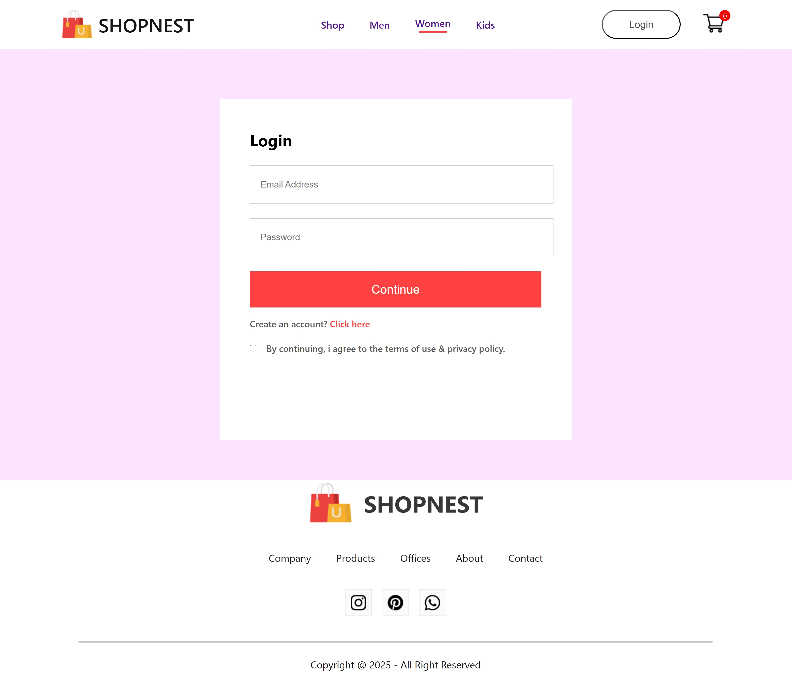
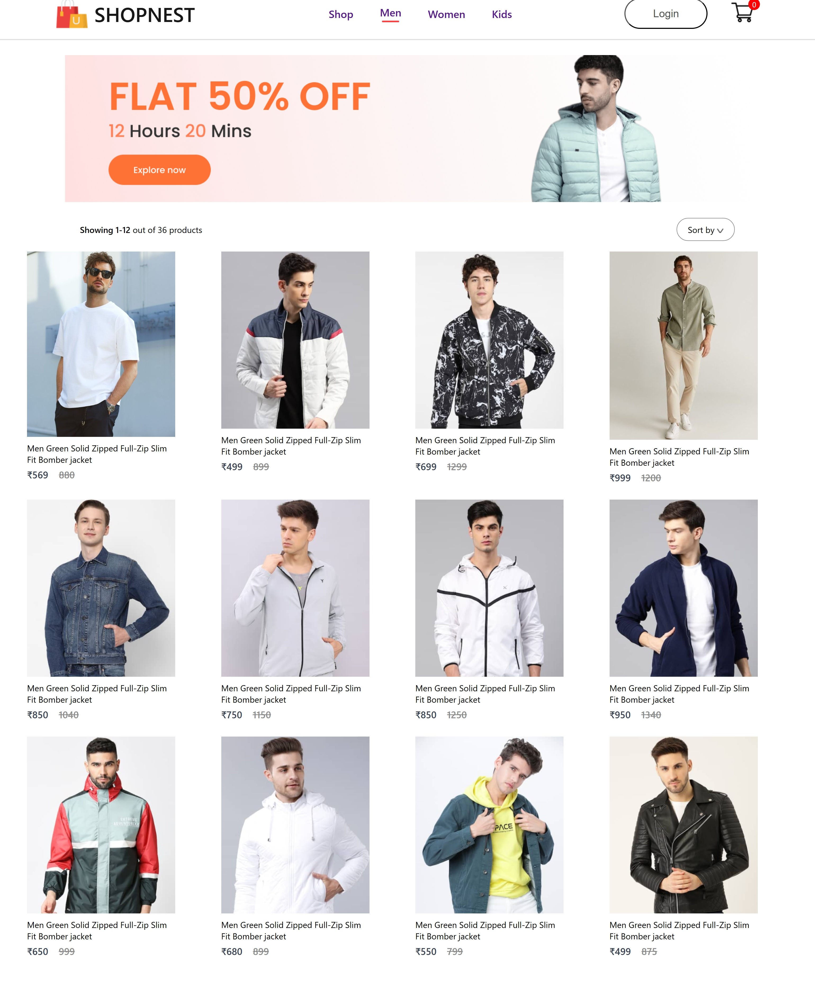
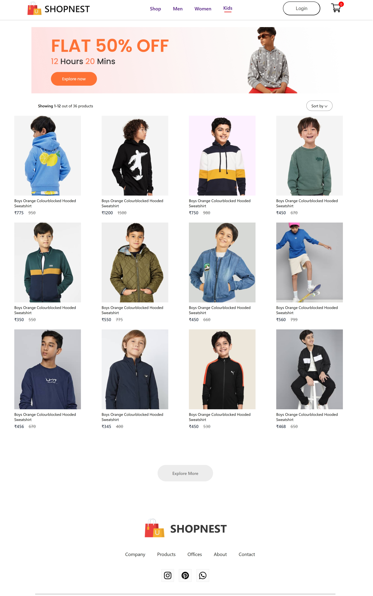
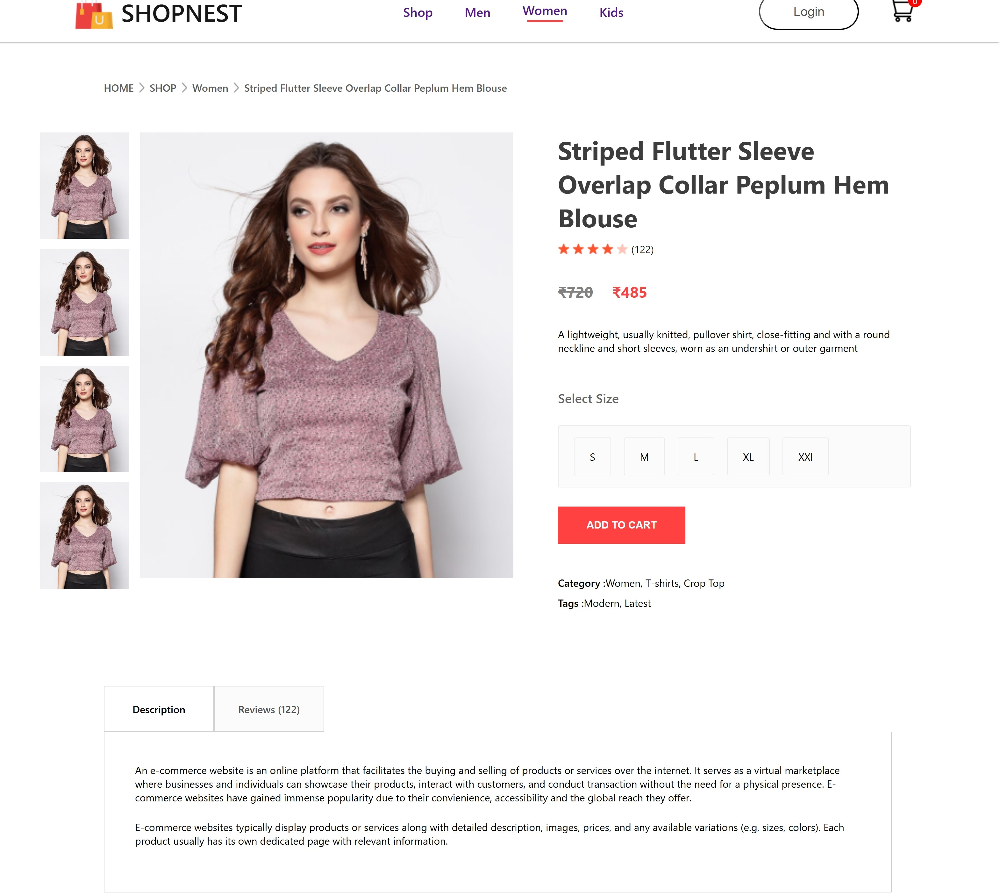
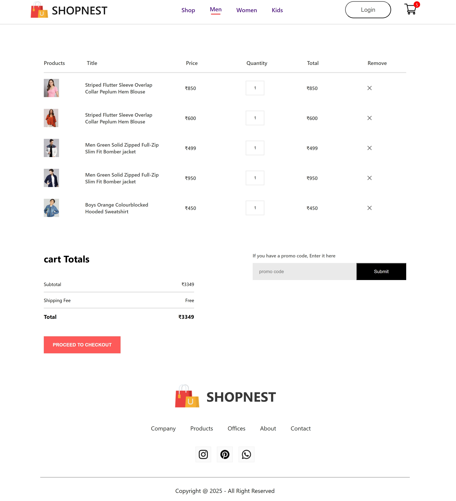

<h1>🛒 Full Stack E-Commerce Website
</h1>

A full stack e-commerce application built with the MERN stack (MongoDB, Express.js, React, Node.js).  
This project allows users to browse products, add them to a cart, and place orders, while admins can manage products and orders.

<h2> 🚀 Features</h2>

- 🔐 User authentication & authorization (JWT) 
- 👤 User registration & login 
- 🛍 Browse products with search & filter 
- 🛒 Shopping cart & checkout 
- 💳 Payment integration (Stripe/PayPal) [if implemented] 
- 📦 Order management (users can view their orders) 
- 🛠 Admin dashboard for product & order management 
- 📱 Responsive design (mobile-friendly)

<h2>🛠 Tech Stack
</h2>

Frontend: React.js, Redux/Context API, TailwindCSS / Bootstrap  
 Backend: Node.js, Express.js  
  Database: MongoDB (Atlas)  
 Authentication: JWT, bcrypt  
 Other Tools: Git, GitHub, Postman, dotenv

 <h2>Home Page</h2>
 
 
 

 <h2>Login Page</h2>
 
 

 <h2>Mens Shop Page</h2>
 
 

 <h2>Women's Shop Page</h2>
 
 

 <h2>Kid's Shop Page</h2>
 
 

 <h2>Product Details</h2>
 
 

 <h2>Cart Page</h2>
 
 
 
